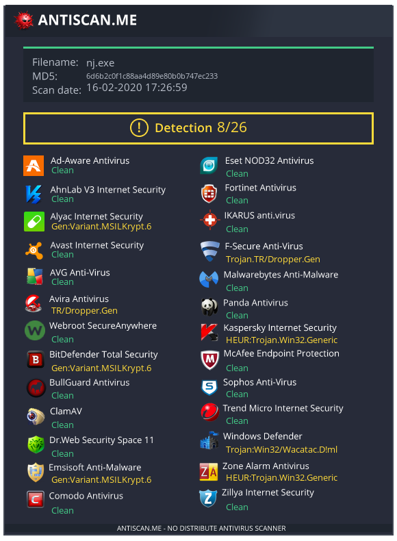

# njCrypter
```Simple Free Crypter for .NET Trojans like njRAT written fully in C#(.NET 2.0)```

### Features:

1.AES256 Encryption

2.Execution in Memory

### Scan: 

<p align="center">
  
</p>

```Download```: https://github.com/0xPh0enix/njCrypter/releases

```How to make it FUD?```: 

To make your crypt FUD you need to obfuscate result with some protector like Confuser, .NET Reactor...

#### Please, do not upload it on virustotal.com!
